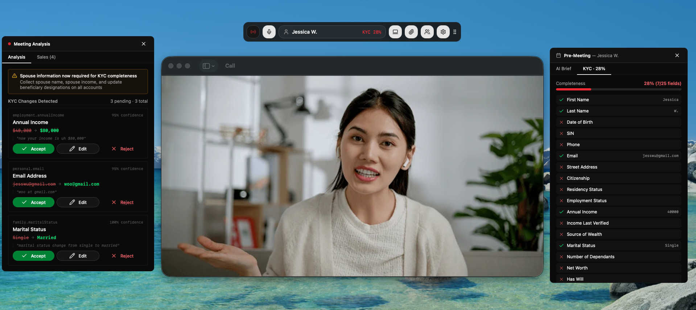
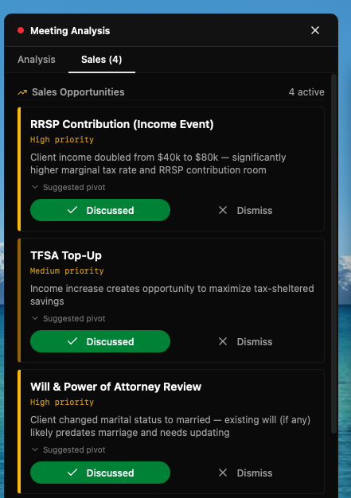

# Salesly

[](https://tauri.app/)
[](https://reactjs.org/)
[](https://anthropic.com/)

> AI-native meeting assistant for wealth management advisors. The advisor runs the meeting — the AI handles everything else.



Salesly is a translucent desktop overlay that listens to live client meetings via microphone and system audio, streams AI assistance in real time, and surfaces KYC gaps, product opportunities, and compliance flags — all while the advisor stays focused on the client relationship.

Built for the **AI Native Contest**.

---

Every advisor knows the feeling: you're sitting across from a client who just shared something important — a new baby, a job change, a retirement dream — and instead of being fully present, you're staring at your notepad trying to capture it before it slips away. The meeting ends. You spend another hour updating the CRM, drafting a summary, and hoping you didn't miss a compliance field. The relationship moment is gone.

Salesly is built to fix that. It listens to advisor-client conversations in real time, surfaces missing KYC fields, flags compliance gaps, and prompts relevant product opportunities the moment a client signals a life change — all through a discreet overlay the advisor sees and the client never does. When the meeting ends, the summary, KYC updates, and client email are already drafted. The advisor's only job is to be present.

What the advisor can now do is give every client their full, undivided attention — every time. Not just when they remember to put the pen down. An advisor running five meetings a day used to leave each one with incomplete notes and a growing administrative backlog. Now they leave with everything already documented, every compliance field captured, and every missed sales opportunity flagged. They can run more meetings, serve more clients, and do it better.

**The AI owns the operational layer:** listening and transcribing in real time, extracting KYC updates as they are spoken, detecting product opportunities from life events the client mentions, generating the post-meeting summary, drafting the client recap email, and pre-loading a brief before the meeting starts so the advisor walks in informed rather than scrambling.

**Two decisions must remain human — and they are deeply connected.**

The first is the meeting itself. KYC information could be collected through a client portal, a form, a chatbot. Technically, it works. But wealth management runs on trust, and trust is built in conversation — in the advisor who remembers your daughter's name, who notices you seem stressed before you say anything, who earns the right to ask about your will. The moment you remove the human from that interaction, you don't just lose warmth. You lose the signal. Clients share their real financial situation when they feel safe. No form replicates that.

The second is committing any KYC change to the client record. Every update Salesly detects lands in a pending queue. The advisor approves, edits, or rejects each one before anything is saved. KYC is a legal document under IIROC/OSC regulation. The advisor carries personal fiduciary liability for its accuracy, and they hold relationship context no AI can — they know when a client is estimating, not ready to formalize, or simply misspoke.

**What breaks first at scale is audio.** The demo runs on the browser's Web Speech API. In production, across hundreds of concurrent meetings, in accented English, over noisy calls, with two speakers talking over each other — that pipeline fails. A real deployment needs financial-vocabulary speech recognition, multi-speaker diarization, and sub-500ms streaming latency to keep the overlay useful in real time. The AI reasoning layer is solid. The data ingestion layer is where the engineering investment goes next.

Salesly handles the administration so the advisor can handle the relationship. The AI earns the client's data. The human earns the client's trust.

---

## What It Does

### Live Meeting Analysis

During a client call, the AI listens continuously and automatically:

- **Detects KYC updates** — e.g. client mentions a promotion, new dependant, change of address
- **Flags compliance issues** — overdue KYC reviews, missing POA, AML concerns
- **Surfaces sales opportunities** — cross-references what the client says against their profile gaps and the product catalog
- **Shows a suggested talking point** the advisor can deliver naturally, without breaking flow

Every detected update goes into a pending queue. Nothing is committed to the client record without explicit advisor approval — the human is always in the loop.

### Human-in-the-Loop Gate

```
AI detects update → pending queue → ✓ Approve          → committed to record
                                  → ✏ Edit → Confirm   → committed (advisor-modified, flagged)
                                  → ✗ Reject            → audit log only
                                  → → Defer             → deferred queue
```

Under IIROC/OSC, KYC is a legal document. The advisor is the fiduciary. The AI can mishear or misinterpret — the approve/edit/reject step is the regulatory firewall and audit trail.

### Pre-Meeting Brief

Before each client meeting, the AI generates a structured brief from the client's full profile:

- Summary of relationship, portfolio, and last meeting notes
- KYC completeness score with field-level breakdown
- Pre-loaded revenue opportunities based on profile gaps (before anyone says a word)

### Post-Meeting Summary

When the meeting ends, the AI automatically generates a debrief from the full diarized transcript and all in-meeting analyses:

- Meeting summary and client sentiment
- KYC changes with approved/edited/rejected breakdown
- Action items and follow-up email draft
- Sales outcomes tracked (discussed / client interested / not raised)

Saved to local conversation history, searchable by client and date.

---

## Tech Stack

| Layer | Technology |
|---|---|
| Desktop shell | Tauri 2 + Rust |
| Frontend | React + TypeScript + Tailwind CSS |
| AI | Anthropic Claude Sonnet 4.6 |
| Mic VAD | @ricky0123/vad-react |
| System audio | CoreAudio process tap (macOS, Rust) |
| State | React hooks + localStorage cross-window sync |
| Persistence | SQLite (via Tauri plugin) |

---

## Multi-Window Architecture

AdvisorCopilot uses multiple Tauri windows sharing state via localStorage + `StorageEvent`:

| Window | Purpose |
|---|---|
| `main` | Toolbar overlay — always-on-top, translucent, drag-anywhere |
| `pre_meeting` | Pre-meeting brief + KYC completeness panel |
| `recording` | Live meeting analysis — KYC queue, compliance flags, sales prompts |
| `post_meeting_summary` | Streaming post-meeting debrief |
| `clients` | Client selector dashboard |
| `dashboard` | Settings, chat history, system prompts |

All windows are decoration-free, transparent, and respect content protection (hidden from screen capture when enabled).

---

## Demo Clients

Three mock client profiles are included for demo:

**Sarah Chen** — Affluent, dual-income tech professional. KYC gaps: income stale since 2022 (got a promotion), KYC overdue, will predates second child, no POA. Great for showing KYC update cards firing in real time.

**Marcus Webb** — HNI, self-employed consultant approaching retirement. Gaps: disability insurance lapsed, TFSA beneficiary not updated post-divorce, corporate holdco estate implications unresolved. Shows retirement planning and business-owner flows.

**Jordan Osei** — New client, bare-bones profile (~8% KYC score). Every answer in the onboarding meeting triggers a new update card. Shows the system working for first meetings, not just annual reviews.

---

## KYC Completeness Scoring

Each client gets a completeness score across 23 required KYC fields. Displayed as a colored badge:

- `< 50%` — red
- `50–79%` — amber
- `≥ 80%` — green

Jordan ≈ 8% · Sarah ≈ 87% · Marcus ≈ 91%

---

## Sales Intelligence

The AI does two types of sales detection simultaneously on every transcript chunk:

**Semantic trigger (Claude-driven):** Claude reads the transcript + client profile and identifies signals from what was *said* — a promotion, interest in buying a home, mention of a sick parent.

**Profile gap trigger (rule-based):** The app checks the client profile on load and flags obviously relevant products before anything is said. Shown as "Today's Revenue Opportunities" in the pre-meeting brief.

Products include: mortgages, life/disability/CI insurance, TFSA, RRSP, RESP, FHSA, ESG portfolios, wills & POA, corporate holdcos, RRIF conversion plans.

Each sales prompt card shows:
- What was said that triggered it
- A suggested talking point the advisor can deliver word-for-word
- Three actions: **Discussed** / **Add to Agenda** / **Dismiss**



---

## Getting Started

### Prerequisites

- Node.js v18+
- Rust (latest stable)
- npm

### Development

```bash
# Install dependencies
npm install

# Start development server
npm run tauri dev
```

### Production Build

```bash
npm run tauri build
```

Outputs to `src-tauri/target/release/bundle/`:
- macOS: `.dmg`

---

## AI Provider Setup

AdvisorCopilot supports any LLM provider via the Dev Space settings. Default is Anthropic Claude Sonnet 4.6.

Add your API key in **Dashboard → Dev Space → AI Providers**.

---

## Key Files

```
src/
├── hooks/
│   ├── useDualRecording.ts          # Mic (Advisor) + system audio (Client) — diarized transcript
│   ├── useCompletion.ts             # Live AI extraction — KYC updates, sales prompts, compliance flags
│   ├── useSystemAudio.ts            # System audio capture hook
│   └── useApp.ts                   # Aggregates all main hooks
├── pages/
│   ├── app/                        # Main toolbar overlay window
│   │   └── components/
│   │       ├── dual-recording/     # DualRecording UI + post-meeting summary trigger
│   │       └── completion/
│   │           └── KYCDiffPanel    # KYC update cards + sales prompt cards
│   ├── pre-meeting/                # Pre-meeting brief window
│   ├── recording/                  # Live meeting analysis window
│   ├── post-meeting-summary/       # Post-meeting debrief window
│   └── clients/                    # Client selector
├── lib/
│   ├── meeting-system-prompt.ts    # Live extraction system prompt (KYC + sales + compliance)
│   └── functions/
│       └── ai-response.function.ts # Streaming AI response helper
src-tauri/src/
├── window.rs                       # All window creation, positioning, show/hide/open/close
├── speaker/
│   ├── macos.rs                    # CoreAudio process tap
│   └── commands.rs                 # Rust VAD + speech-detected event emitter
└── lib.rs                          # Tauri command registration + startup
```

---

## Compliance Design

**What AI handles:** Real-time listening, KYC extraction, profile-gap product matching, semantic sales signal detection, compliance flagging, post-meeting summary, email drafting.

**What AI cannot do:** Commit KYC changes to the client record without explicit advisor approval, or make any recommendation directly to the client. Sales prompts go to the *advisor* — they exercise judgment on fit, timing, and relationship context. IIROC suitability obligations require a human to own every recommendation.

**Audit trail:** Every KYC change is tagged `ai_approved`, `advisor_edited` (includes both AI suggestion and final value), or `rejected`. Compliance teams get a full picture of what AI proposed vs. what the human decided.

---

## Acknowledgments

- [Tauri](https://tauri.app/) — Desktop framework
- [Anthropic](https://anthropic.com/) — Claude AI models
- [shadcn/ui](https://ui.shadcn.com/) — UI components
- [@ricky0123/vad-react](https://github.com/ricky0123/vad) — Voice Activity Detection
- [tauri-nspanel](https://github.com/ahkohd/tauri-nspanel) — macOS native panel integration
